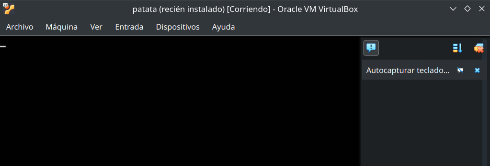

# Tarea 1 Despliegue

### Nombre y apellidos

---
## VirtualBox
Crea una red NAT con dos máquinas virtuales (MV):

* Servidor: con un Ubuntu server sin entorno gráfico.

  * Usuario: sergio, contraseña: sergio.

* Casa: con un Lubuntu con el entorno gráfico por defecto (LXQt).

  * Usuario: carmen, contraseña: carmen.

Ambas MV deben ser accesibles mediante ssh desde el equipo anfitrión.
Muestra el redireccionamiento de puertos (port forward)

Desde virtualbox comenzamos a crear la red NAT.

